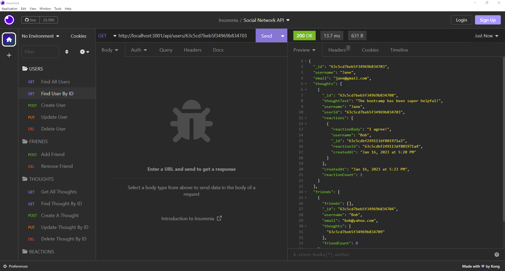

# Social Network API

## Description

This Social Network API is the back-end for a social network web application in which users can share their thoughts, friend other users, and react to friends' thoughts. The project uses Express.js for routing, MongoDB as the NoSQL database, and Mongoose as the ODM. This project helped me practice using Mongoose to query the MongoDB database via Node.js. It also helped me understand how existing social networking platforms manage large amounts of unstructured data.

## Table of Contents

- [Installation](#installation)
- [Usage](#usage)
- [License](#license)
- [How to Contribute](#how-to-contribute)

## Installation

Download Node.js and MongoDB for your platform. After cloning this repository, run the following command in the terminal to install the Express, Mongoose, and DayJS package dependencies:
```
npm install
```

## Usage

Open your terminal in this repository. You can seed the database with mock users and thoughts by running the following command in the terminal:
```
npm run seed
```

Run the following command in the terminal to start the server and use this application:
```
nodemon index.js
```

Test the different API endpoints/routes using an application like Insomnia.

Here is a [walkthrough video](https://drive.google.com/file/d/1TdU-FjFmqFOE3ZIJF0j7DbV7nCojW5Tz/view?usp=sharing) demonstrating the functionality of the app.

Here are screenshots showing the results of the "GET all users" and "GET user by ID" routes:




## License

MIT License. Please refer to the LICENSE in the repo.

## How to Contribute

If you would like to contribute to this project, please email me at: avani.muchhala@case.edu.